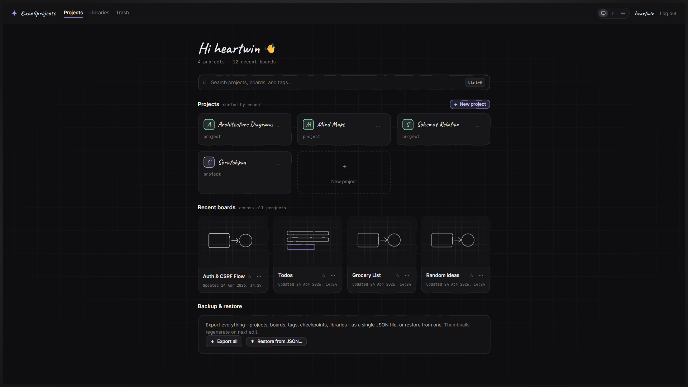
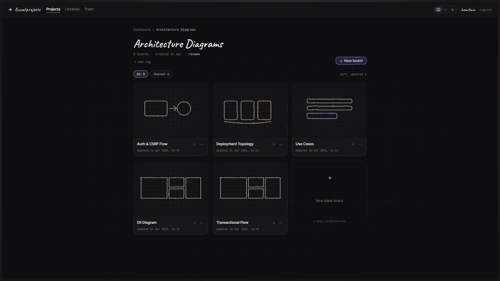
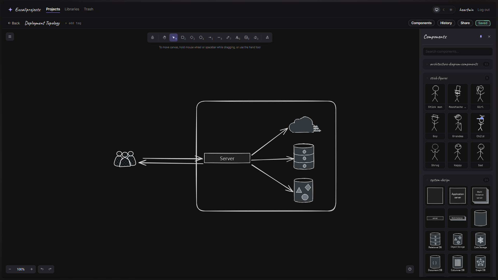
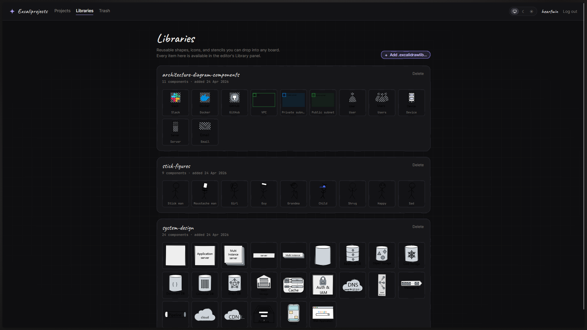

# Excaliprojects

**Your own Excalidraw, organised.** A personal, single-user, self-hosted workspace that turns an infinite canvas into *projects*, *boards*, and a drawer full of reusable components — all running as one Docker Compose stack on a server you own.

<p align="center">
  
</p>

> **Not an Excalidraw+ alternative.** If you need team workspaces, real-time multiplayer, AI, or PDF/PPTX export, use [Excalidraw+](https://plus.excalidraw.com/). Excaliprojects is for a single person who wants their diagrams on their own box.

---

## Why Excaliprojects?

- **It's yours.** Boards live in your Postgres, images on your volume. `docker compose down -v` and only you own the aftermath.
- **No "save" button.** Every stroke debounces straight into the database; tabs crash, laptops die, work is already safe.
- **Shaped like your brain.** Group drawings into projects, tag both boards *and* projects, fuzzy-search the lot with `⌘K` / `Ctrl+K`.
- **A library you actually use.** Upload `.excalidrawlib` files once; they appear as grouped, draggable components in a dockable sidebar in every board.
- **Sharable without invites.** One click turns any board into a read-only public link you can revoke or expire.

---

## Highlights

- **Projects & boards** with rename, duplicate, move, and soft-delete (30-day recovery).
- **Version history** — auto-snapshots every few saves plus labelled checkpoints you can pin forever.
- **Grouped component sidebar** inside the editor, pinnable, drag-to-canvas, theme-matched previews.
- **Public share links** — unguessable tokens, optional expiry, revocable per board.
- **Backup & restore** a whole workspace as a single JSON file.
- **Light, dark & system themes** applied everywhere.
- **Responsive** from day one — works on a phone browser.
- **Solid defaults** — argon2 hashes, signed CSRF-protected cookies, login rate-limiting, tight CSP.

See the [changelog](CHANGELOG.md) for everything that's in `v1.0.0`.

---

## Quickstart

```bash
git clone https://github.com/HeartwinJ/excaliprojects.git
cd excaliprojects
cp .env.example .env
# edit .env — set SEED_USERNAME, SEED_PASSWORD, SESSION_SECRET,
# POSTGRES_PASSWORD, and PUBLIC_APP_URL.
docker compose up -d
```

Then point your reverse proxy (Caddy, Traefik, nginx, Cloudflare — your call) at `http://<host>:${APP_PORT}`. TLS is terminated upstream; Excaliprojects intentionally ships without a proxy or certificate story of its own.

Migrations run automatically on every boot. To upgrade:

```bash
docker compose pull
docker compose up -d
```

---

## Screenshots

<p align="center">
  
</p>

<p align="center">
  
</p>

<p align="center">
  
</p>

---

## Configuration

Everything lives in `.env`. [`.env.example`](.env.example) is the full reference. The variables you'll touch on first install:

| Variable | Purpose |
|---|---|
| `APP_PORT` | Host port the web container binds to. |
| `PUBLIC_APP_URL` | Externally-reachable URL. Used to build share links and decide the cookie `Secure` flag. |
| `SEED_USERNAME` / `SEED_PASSWORD` | Seed user created on first boot. |
| `SESSION_SECRET` | Long random string signing session cookies. Rotating logs everyone out. |
| `POSTGRES_PASSWORD` | Database password. |

---

## Backing up

You've got two options — use whichever fits.

- **In-app JSON backup.** Click *Export all* on the dashboard to download the entire workspace as one JSON file. Restore with *Restore from JSON…* on any fresh install. Thumbnails regenerate on next edit.
- **Volume backup.** `pg_dump` the `db` volume and `tar` the `files` volume. Classic belt-and-braces.

---

## Development

Requirements: Node.js ≥ 20, Docker.

```bash
npm install
docker compose up -d db          # just Postgres
npm run dev                       # server + client in watch mode
```

Server default: `http://localhost:3000`. See [`CONTRIBUTING.md`](CONTRIBUTING.md) for repo conventions, commit style, and release process.

---

## Credits

The drawing experience is powered entirely by [`@excalidraw/excalidraw`](https://github.com/excalidraw/excalidraw) (MIT). Full third-party attributions in [`NOTICE`](NOTICE).

## License

[MIT](LICENSE).
